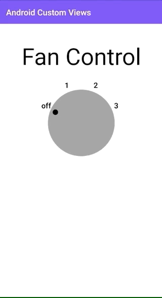

# Android-Custom-Views
A repo showing how to work with custom views in Android. It draws a dial view to represent fan speed. There are 4 states.

1. OFF
2. LOW
3. MEDIUM
4. HIGHT

The view also shows how to handle custom attributes. It receives colors for low, medium and high states from the XML.




### Usage

```
<github.informramiz.androidcustomviews.dialview.DialView
        android:id="@+id/dialView"
        android:layout_width="200dp"
        android:layout_height="200dp"
        app:fanLowColor="@color/fanLowColor"
        app:fanMediumColor="@color/fanMediumColor"
        app:fanHighColor="@color/fanHighColor"/>
```